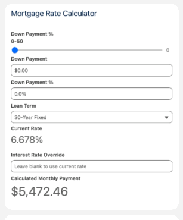
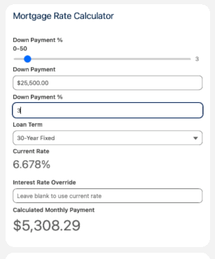
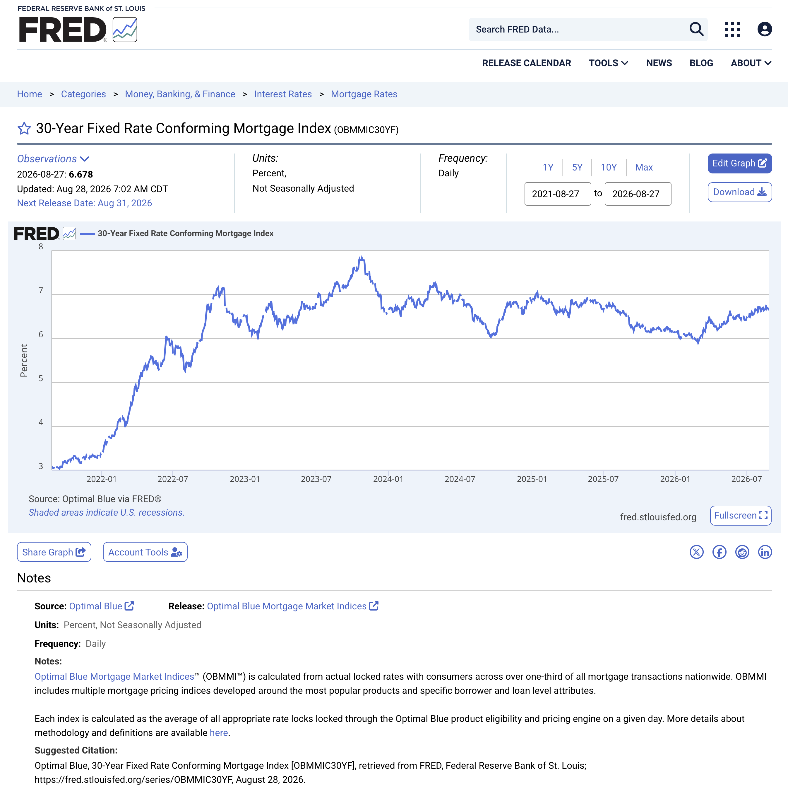

# Mortgage Rate Calculator

A live-rate mortgage payment estimator added to the Property record page,
pulling daily interest rates from the FRED API.

## What it does

_(Property Price in demo is $850,000)_

## FRED API

- [FRED](https://fred.stlouisfed.org) provides up-to-date economic data 
- [30-Year Fixed Rate Conforming Mortgage Index (OBMMIC30YF)](https://fred.stlouisfed.org/series/OBMMIC30YF) was used for gathering average mortgage rate data which is updated daily

## Calculator Formula

The standard formula to calculate a fixed-rate monthly mortgage payment is:

**M = P [ r(1 + r)^n ] / [ (1 + r)^n - 1 ]**

- M: Total monthly payment (the final number you display to the user).
- P: Principal loan amount. This is the purchase price of the property minus the user's down payment.
- r: Monthly interest rate. (Note: External APIs will give you the annual interest rate as a percentage, like 6.5%. You must divide this by 100 to get the decimal, and then divide by 12 to get the monthly rate).
- n: Total number of payments over the life of the loan. For a standard 30-year mortgage, this is 360 (30 years × 12 months).

## Architecture
- [`force-app/main/default/classes/MarketRateController.cls`](../force-app/main/default/classes/MarketRateController.cls) — Apex controller
- [`force-app/main/default/classes/MarketRateAPICallout.cls`](../force-app/main/default/classes/MarketRateAPICallout.cls) — FRED callout + parsing
- [`force-app/main/default/classes/MarketRateQueueableJob.cls`](../force-app/main/default/classes/MarketRateQueueableJob.cls) — Queueable Interface to asynchronously callout to FRED API
- [`force-app/main/default/classes/MarketRateCalloutScheduler.cls`](../force-app/main/default/classes/MarketRateCalloutScheduler.cls) — Schedules the queuable job
- [`force-app/main/default/classes/MarketRateFredObservationResponse.cls`](../force-app/main/default/classes/MarketRateFredObservationResponse.cls) — Parses the FRED API response and creates an Observation object that is converted to a Market Rate custom object
- [`force-app/main/default/classes/PropertyController.cls`](../force-app/main/default/classes/PropertyController.cls) — DreamHouse original class, updated to include a query for a property of a specified recordId
- [`force-app/main/default/lwc/marketRateCalculator/`](../force-app/main/default/lwc/marketRateCalculator/) — the component
- [`force-app/main/default/objects/Market_Rate__c/`](../force-app/main/default/objects/Market_Rate__c/) — daily rate storage custom object
- [`force-app/main/default/objects/API_Credential__mdt`](../force-app/main/default/objects/API_Credential__mdt) – Custom metadata object used for holding API Credentials such as keys
- [`force-app/main/default/externalCredentials/FRED.externalCredential-meta.xml`](../force-app/main/default/externalCredentials/FRED.externalCredential-meta.xml) – External Credentials for integration to FRED API
- [`force-app/main/default/namedCredentials/FRED_Mortgage_Rates.namedCredential-meta.xml`](../force-app/main/default/namedCredentials/FRED_Mortgage_Rates.namedCredential-meta.xml) – Named Credentials for integration to FRED API
- [`scripts/apex/schedule-fred-sync.apex`](../scripts/apex/schedule-fred-sync.apex) – Executable Apex for setting a daily scheduled job to retrieve latest Market Rate from FRED API

## Unit Tests
- [`force-app/main/default/classes/MarketRateControllerTest.cls`](../force-app/main/default/classes/MarketRateControllerTest.cls)
- [`force-app/main/default/classes/MarketRateAPICalloutTest.cls`](../force-app/main/default/classes/MarketRateAPICalloutTest.cls)
- [`force-app/main/default/classes/MarketRateSchedulingTest.cls`](../force-app/main/default/classes/MarketRateSchedulingTest.cls)
- [`force-app/main/default/classes/MarketRateFredObservationResponseTest.cls`](../force-app/main/default/classes/MarketRateFredObservationResponseTest.cls)